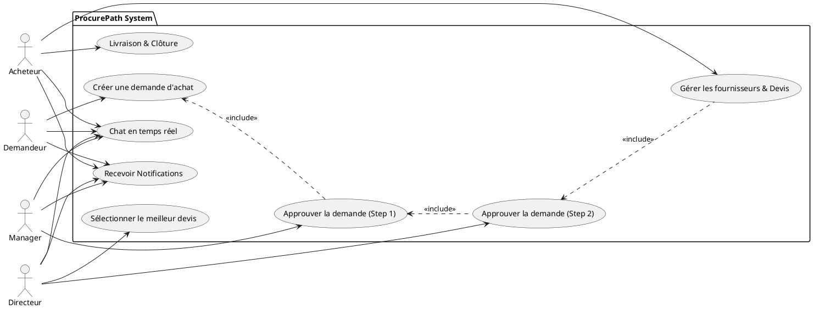
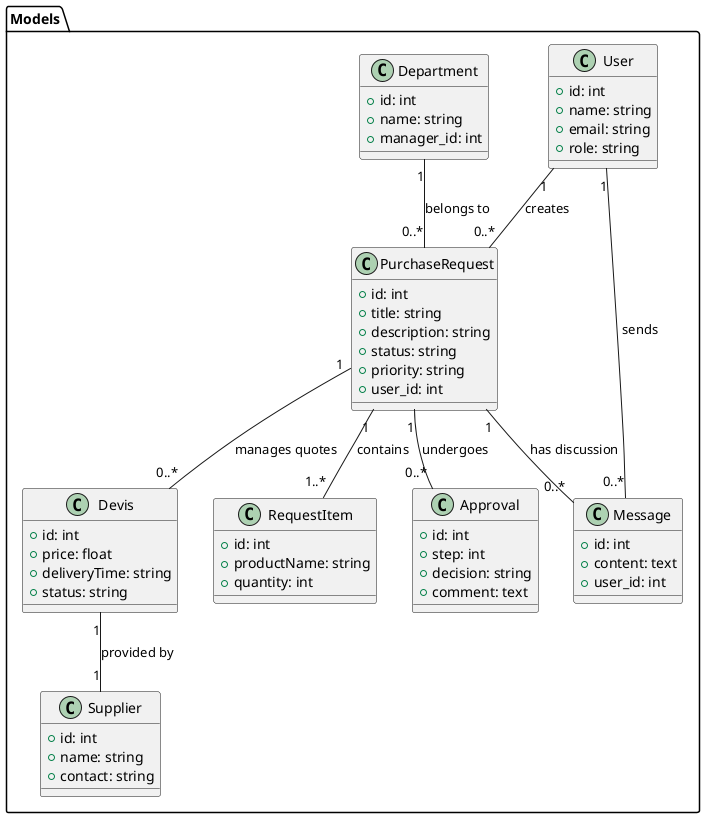

# ProcurePath: Documentation & Planification

## 1. Use Case Diagram (PlantUML)

---

## 2. Class Diagram (PlantUML)

---

## 3. Simple Planification (KISS)

### **Phase 1: Backend Foundation (The Engine)**
1.  **Auth & Roles**: Setup Sanctum and the `RoleMiddleware` you just created.
2.  **Workflow API**: Create the standard CRUD for Purchase Requests and the Approval logic.
3.  **Broadcasting**: Configure Reverb and Events (`MessageSent`, `StatusUpdated`) for real-time.
4.  **Module Fournisseurs**: Basic API to manage Suppliers and their Quotes (Devis).

### **Phase 2: Frontend Core (The Cockpit)**
1.  **Auth Pages**: Login/Register with instant redirection.
2.  **Dashboard**: A clear list of requests filtered by the user's role.
3.  **Request Flow**:
    - **Step 1**: Creation form (Demandeur).
    - **Step 2**: Approval UI with comments (Manager/Directeur).
    - **Step 3**: Quote management (Acheteur).
    - **Step 4**: Quote selection (Directeur).

### **Phase 3: Real-time & Polish (The Turbo)**
1.  **Chat Integration**: Connect Echo to the discussion sub-module.
2.  **Notifications**: Real-time bell alerts for status changes.
3.  **UI Refinement**: Ensure the dark "Glassmorphism" theme is consistent across all pages.

### **Phase 4: Validation (The Crash Test)**
1.  **End-to-End Test**: Simulate a full request from Demandeur -> Manager -> Directeur -> Acheteur -> Directeur (Quote) -> Delivered.
2.  **Bug Squashing**: Fix minor UI or WebSocket glitches.
