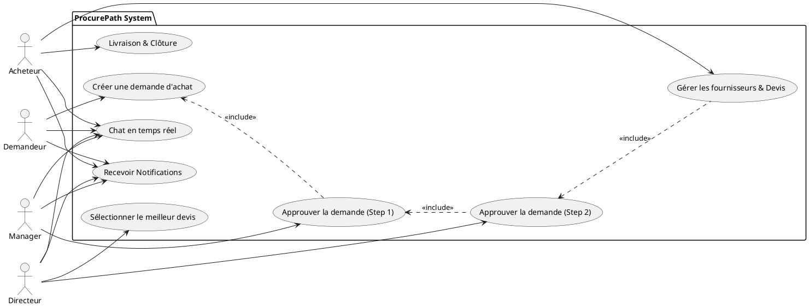
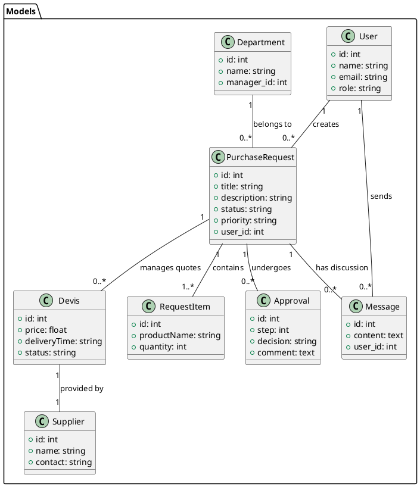

# ProcurePath: Documentation & Planification

## 1. Use Case Diagram (PlantUML)

---

## 2. Class Diagram (PlantUML)

---

## 3. Logique Métier (Enums & Acteurs)

### **États de la Demande (Enums)**
- `draft` : Brouillon (créateur uniquement).
- `pending_manager` : En attente validation Manager.
- `pending_directeur` : En attente validation Directeur.
- `approved` : Validé, prêt pour traitement.
- `in_progress` : Pris en charge par l'Acheteur.
- `consultation` : Recherche de fournisseurs/devis.
- `ordered` : Commande passée.
- `delivered` : Livraison effectuée (Clôturé).
- `rejected` : Demande refusée.

### **Actions par Acteur**
- **Demandeur** : Créer, enregistrer brouillon, soumettre, discuter.
- **Manager** : Approuver/Rejeter étape 1 (Département).
- **Directeur** : Approuver/Rejeter étape 2, Sélectionner Devis, Administration.
- **Acheteur** : Gérer Fournisseurs, Saisir Devis, Mettre à jour les étapes logistiques.

---

## 4. Simple Planification (KISS)

### **Phase 1: Backend Foundation**
- Auth (Sanctum) & RoleMiddleware.
- Workflow API (CRUD + Approvals).
- Real-time (Reverb + Events).

### **Phase 2: Frontend Core**
- Dashboard filtré par rôle.
- Formulaires de création et validation.
- Gestion des Devis (Interface Acheteur/Directeur).

### **Phase 3: Polish & Real-time**
- Chat discussion & Pièces jointes.
- Système de notifications temps réel.
- Thème Glassmorphism final.
